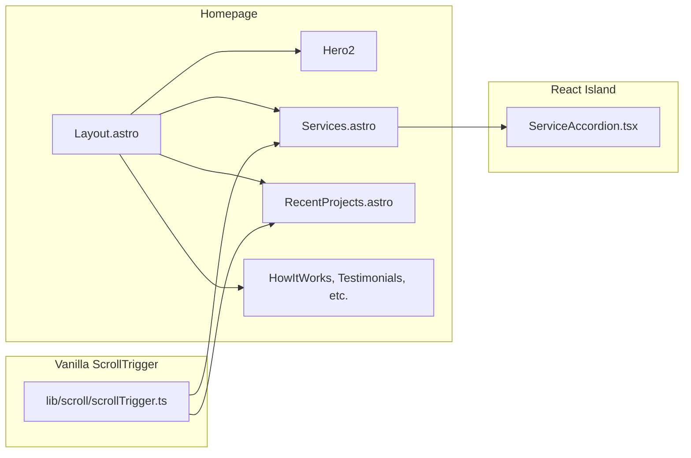

# Hybrid ScrollTrigger + Services/Projects Redesign

## Architecture

- **Scroll effects:** Vanilla JS only. A shared scroll utility is used by Services and Projects to create pins, text reveals, and scrub tweens. No React for scroll.
- **Interactive UI:** Only the Services accordion (open/close + GSAP height animation) is a React island; everything else stays Astro + vanilla.

## 1. Shared ScrollTrigger utility (vanilla)

**Create** [src/lib/scroll/scrollTrigger.ts](src/lib/scroll/scrollTrigger.ts)

- **Single registration:** `registerScrollTrigger()` — call `gsap.registerPlugin(ScrollTrigger)` (idempotent). Export so section scripts can call it before using helpers.
- **Helpers (all vanilla, return cleanup):**
  - `createSectionPin(options)` — pin an element for a section (e.g. Services header). Options: `trigger`, `pinTarget`, `start`, `end`, `pinSpacing`. Uses `ScrollTrigger.create()` and returns a function that kills that instance.
  - `createTextReveal(options)` — scroll-triggered reveal (y + opacity). Options: `element`, `trigger`, `start`, `y`, `duration`, `ease`. Returns cleanup.
  - `createScrubTween(options)` — scrub animation (e.g. title fade as content scrolls over). Options: `element`, `trigger`, `start`, `end`, `from`, `to`. Returns cleanup.
  - `createStackedCardPins(cardElements)` — for Projects: pin each card (first N-1 with `end: '+=100%'`, last with `pinSpacing: true`). Returns cleanup.
- **Cleanup:** Each helper uses `gsap.context()` (or direct ScrollTrigger refs) and returns a `revert` function. Sections call revert on `astro:before-swap` if using view transitions, or rely on full page unload.
- **Reduced motion:** Check `prefers-reduced-motion: reduce`; if true, skip pin/reveal/scrub or use no-op cleanup.
- **Dependencies:** Import `gsap` and `gsap/ScrollTrigger`. No React.

This keeps all ScrollTrigger logic in one place and avoids duplication between Services and Projects.

## 2. Services section redesign

**Goal:** Same structure and behavior as [template_app_smooth_scrolling/src/sections/ServicesSection.tsx](template_app_smooth_scrolling/src/sections/ServicesSection.tsx): full-viewport sticky header (with blue background and title) then scrolling content with accordion. Keep blue background and your title; match template layout and content structure (brief description per service).

**Data shape (template-style):** Each service: `id`, `title`, `description` (short), `tags[]`, `image` (one URL). Merge current main + other services into one list and add `id` + short `description`; use existing `tools` as `tags` and pick one image per service (e.g. `image1`).

**Create** [src/content/services-home.json](src/content/services-home.json) (or equivalent)

- Array of `{ id, title, description, tags, image }`. Populate from current [Services.astro](src/components/Services.astro) mainServices + otherServices (add slugs for id, 1–2 sentence descriptions).

**Create** [src/components/ServiceAccordion.tsx](src/components/ServiceAccordion.tsx) (React island)

- Port from [template ServiceAccordion](template_app_smooth_scrolling/src/components/animations/ServiceList.tsx) (lines 21–155): one open item, GSAP for height/opacity, scroll-triggered reveal for items. Props: `services: { id, title, description?, tags?, image? }[]`, `defaultOpen: string | null`.
- Use your site’s Tailwind tokens (e.g. `border-border`, `text-foreground`, `text-muted-foreground`) so it matches [global.css](src/styles/global.css). No Radix; plain buttons + state.
- Client directive: `client:visible` for performance.

**Rewrite** [src/components/Services.astro](src/components/Services.astro)

- **Layout:**
  - One `<section>` with a single sticky header block and one scrolling content block.
  - **Header:** Full viewport height (`min-h-screen`), blue background (e.g. `bg-accent` or a blue overlay on a subtle image if you prefer), centered large title. Keep current section title text (e.g. “Websites that convert. Plus other ways we help streamline your business.”) or shorten to “Services” per your preference; user asked to “keep blue background and title.”
  - **Content:** `relative z-20 bg-background min-h-screen`, inner container with padding; inside it, only the ServiceAccordion island with the new data.
- **ScrollTrigger (vanilla):** In a `<script>` (or imported from a small script that uses the scroll lib):
  - Call `registerScrollTrigger()`.
  - Pin the header: `createSectionPin({ trigger: section, pinTarget: headerRef, start: 'top top', end: 'bottom bottom', pinSpacing: false })`.
  - Title reveal: `createTextReveal({ element: titleEl, trigger: headerRef, start: 'top 60%', ... })`.
  - Title fade as content scrolls over: `createScrubTween({ element: titleEl, trigger: contentRef, start: 'top 80%', end: 'top 30%', to: { opacity: 0, y: -50 } })`.
  - Use `data-` attributes or `querySelector` to get section, header, title, content nodes. Return/run cleanup on `astro:before-swap` if view transitions are used.
- **Data:** Import services from `services-home.json` (or frontmatter), map to the shape expected by ServiceAccordion, pass as props to the island.

Result: Same visual/scroll behavior as the template Services section, with blue header and your title, and template-like content structure (brief description + tags + one image per service).

## 3. Projects section revamp

**Goal:** Same structure as [template_app_smooth_scrolling/src/sections/ProjectsSection.tsx](template_app_smooth_scrolling/src/sections/ProjectsSection.tsx): section header (title + subtitle) with text reveal, then stacked full-viewport cards; each card pinned until the next scrolls over it. Use existing [projects.json](src/content/projects.json) and existing project images (e.g. [RecentProjects.astro](src/components/RecentProjects.astro) image map).

**Data mapping:** Current project: `id`, `title`, `summary`, `tags`, `viewUrl`. For the template-style card use: `id`, `name` = `title`, `category` = `tags[0] `or “Project”, `image` = resolved URL from current image map, `bgColor` = from a small palette array (e.g. 4–5 hex colors, assigned by index), `viewUrl` for link. Optionally add a `date` field (e.g. “Featured”) or leave empty; template shows date and category in the card header.

**Rewrite** [src/components/RecentProjects.astro](src/components/RecentProjects.astro)

- **Structure:**
  - **Header:** Same as template: title (e.g. “Featured projects”) + subtitle, centered, in a block that is not pinned.
  - **Cards:** One wrapper; inside it, one full-viewport block per project (`min-h-screen`, `position: relative`). Each block: background color from `bgColor`, card header (date left, category right), project name (large type), then image (e.g. 16/9) and optional “View project” link using `viewUrl`. Use existing imports for images; pass resolved `src` (e.g. from Astro’s image import) into the card so we use a single `` or `<Image>` with that src.
- **ScrollTrigger (vanilla):** In a `<script>`:
  - Call `registerScrollTrigger()`.
  - Header text reveal: `createTextReveal` for title and subtitle (same pattern as template).
  - Stacked pins: get all card elements (e.g. `section.querySelectorAll('[data-project-card]')`), then `createStackedCardPins(cardElements)` so each card pins as in the template (first cards `end: '+=100%'`, last card `pinSpacing: true`).
  - Cleanup on `astro:before-swap` or page unload.
- **Responsive:** Keep full-viewport cards; use responsive typography and padding (e.g. template’s `px-8 md:px-16`, `text-5xl md:text-7xl`). Images: `object-cover`, constrained aspect ratio.

No React here; all scroll behavior is vanilla using the shared scroll lib.

## 4. Homepage scroll “premium” effect

**Scope:** “Parallax scroll effect / smooth scroll for the homepage (affects all as the user scrolls)” is achieved by:

- Services: pinned header + title reveal + scrub (above).
- Projects: stacked pinned cards + header text reveal (above).
- Optional: Other sections (HowItWorks, Testimonials, etc.) can get a subtle scroll-in effect by adding `data-scroll-reveal` and a small vanilla script that uses `createTextReveal` (or a simple IntersectionObserver) for those elements. Prefer reusing the same scroll utility so behavior is consistent and code stays minimal.

**Hero2:** Current parallax in [Hero2.astro](src/components/Hero2.astro) is already a scroll listener. You can leave it as-is for this phase; unifying it with GSAP can be a later step if desired.

**Layout:** [Layout.astro](src/layouts/Layout.astro) already has `overflow-x: hidden` on body. No need for a separate scroll wrapper unless you add a dedicated “smooth scroll” wrapper later. Keep `scroll-behavior: smooth` for anchor links; ScrollTrigger handles the premium effects.

## 5. Performance and responsiveness

- **GSAP/ScrollTrigger:** Load only where needed. Since only the homepage uses pins/reveals, the scroll script should be included only on the index page (e.g. Services and RecentProjects each include a script that imports from `@/lib/scroll/scrollTrigger`). That way other pages do not load GSAP for these effects.
- **ServiceAccordion:** Use `client:visible` so the island hydrates only when the Services section is near the viewport.
- **Images:** Services: one image per service in the accordion (lazy load). Projects: use existing optimized images; lazy load below-the-fold cards if desired.
- **Reduced motion:** All scroll helpers respect `prefers-reduced-motion`; Layout already has reduced-motion overrides.
- **Cleanup:** Each section’s script stores the revert function and calls it on `astro:before-swap` (if view transitions are enabled) so ScrollTrigger instances are killed on navigation.

## 6. File summary

| Action | File |

|--------|------|

| Create | `src/lib/scroll/scrollTrigger.ts` — register + createSectionPin, createTextReveal, createScrubTween, createStackedCardPins + cleanup |

| Create | `src/content/services-home.json` — list of services with id, title, description, tags, image |

| Create | `src/components/ServiceAccordion.tsx` — React island (template ServiceAccordion port, your tokens) |

| Rewrite | `src/components/Services.astro` — template layout, blue header, vanilla pin/reveal/scrub, ServiceAccordion island |

| Rewrite | `src/components/RecentProjects.astro` — template-style stacked cards, vanilla pins + text reveal, existing projects + images |

| Optional | Add `data-scroll-reveal` + small init for other homepage sections |

No changes to [index.astro](src/pages/index.astro) section order; only Services and RecentProjects are replaced in place with the new implementations.

## 7. Implementation order

1. Implement `src/lib/scroll/scrollTrigger.ts` and types.
2. Add `src/content/services-home.json` and port `ServiceAccordion.tsx` with your design tokens.
3. Redesign `Services.astro` (markup + vanilla script + island).
4. Redesign `RecentProjects.astro` (data mapping, markup + vanilla script).
5. Test pins, reveals, and accordion on homepage; verify cleanup and reduced motion.
6. Optionally add scroll reveal for other sections and tune responsive breakpoints.